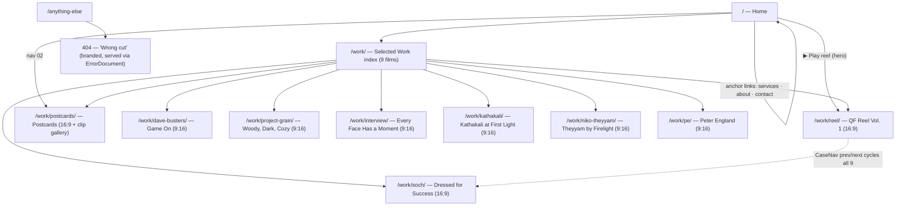
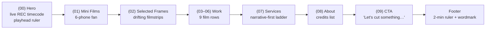
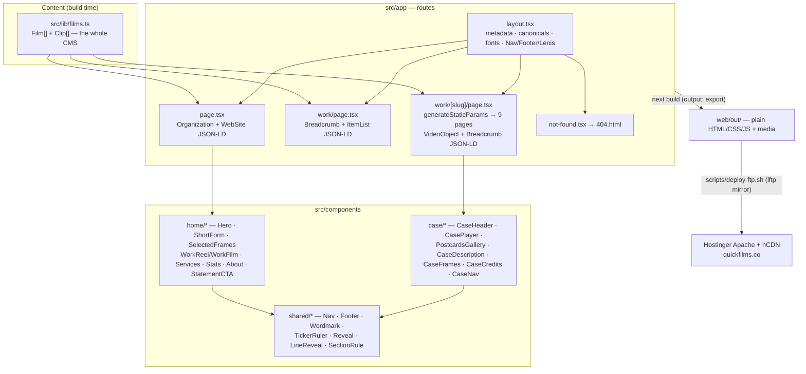
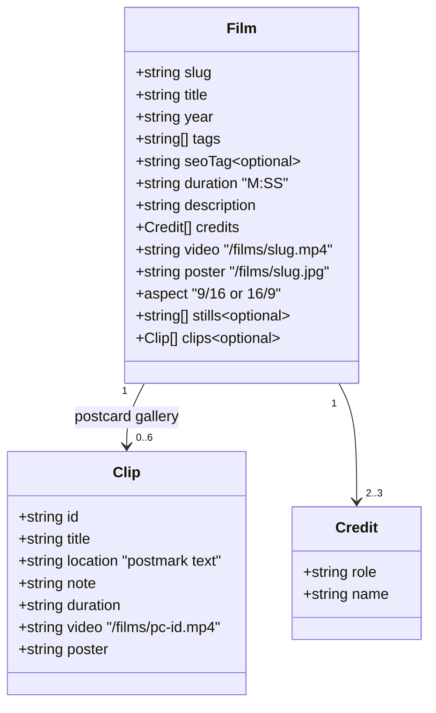
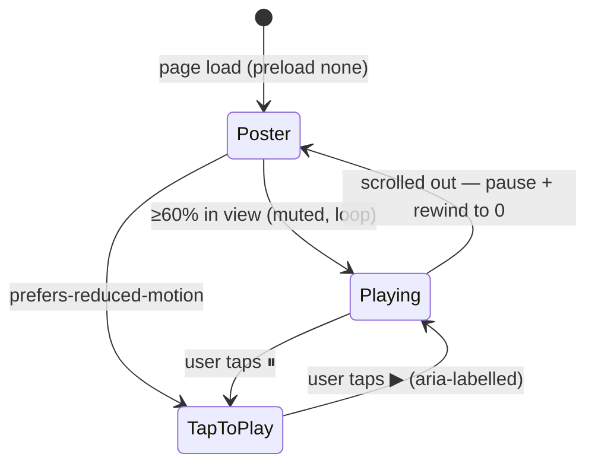
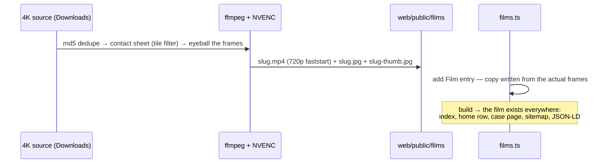
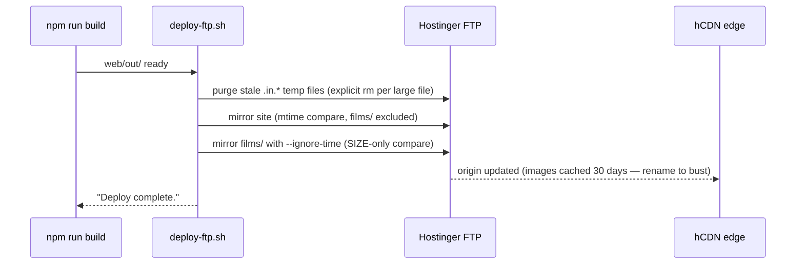

# Quick Films

**Narrative & brand film studio, Bengaluru — the website.**

🎬 **Live: [quickfilms.co](https://quickfilms.co)** · 🎞️ [Showreel](https://quickfilms.co/work/reel/) · 💌 [Postcards](https://quickfilms.co/work/postcards/) · 🗂️ [All work](https://quickfilms.co/work/)

A dark, cinematic, single-brand portfolio for **Quick Films** — a video editing, colour grade and
motion studio in Bengaluru, India. Nine films, a phone-fan of vertical reels, a living timecode
ruler with a sweeping playhead, and a bespoke "postcard wall" gallery. Built as a fully static
Next.js export and served from plain Apache hosting — no server runtime anywhere.

> Brand direction is locked in [`BRAND.md`](./BRAND.md): BDO Grotesk Variable + Inter,
> red `#F5352B` · yellow `#F5C518` · near-black `#0b0b0a`, referenced on
> [anamorph.framer.website](https://anamorph.framer.website) — moody, cinematic, editorial.

---

## Table of contents

1. [The stack](#the-stack)
2. [Site map](#site-map)
3. [Architecture](#architecture)
4. [The film catalogue](#the-film-catalogue)
5. [Data model](#data-model)
6. [The motion system](#the-motion-system)
7. [The Postcards gallery](#the-postcards-gallery)
8. [Video encoding pipeline](#video-encoding-pipeline)
9. [Repository layout](#repository-layout)
10. [Development](#development)
11. [Deployment](#deployment)
12. [SEO layer](#seo-layer)
13. [Accessibility](#accessibility)
14. [QA](#qa)

---

## The stack

| Layer | Choice | Why |
|---|---|---|
| Framework | **Next.js 16** (App Router, `output: "export"`) | Static HTML per route, zero server runtime, works on any FTP host |
| UI | **React 19** + **TypeScript 5** | |
| Styling | **Tailwind CSS 4** (tokens in `globals.css` `@theme`) | Single source of truth for palette/type |
| Motion | **framer-motion 12** + **Lenis** smooth scroll | Reveals, playhead, parallax; Lenis exposed as `window.__lenis` for programmatic scrolls |
| Type | Self-hosted **BDO Grotesk Variable** (display) + **Inter** (body) | No external font requests |
| Media | Hand-encoded H.264 MP4s (NVENC), poster JPEGs, `preload="none"` everywhere | Nothing streams until asked |
| Hosting | **Hostinger** shared Apache + hCDN edge | `.htaccess` handles compression, caching, `www→apex` 301 and the branded 404 |
| Deploy | `lftp` mirror via [`scripts/deploy-ftp.sh`](./scripts/deploy-ftp.sh) | See [Deployment](#deployment) — the script has scars and the fixes to show for them |
| Encode rig | ffmpeg + **NVENC** (RTX 3070) | 4K sources → web 720p in seconds |

No CMS, no database, no analytics script, no cookie banner. The entire content model is one
typed TypeScript file: [`web/src/lib/films.ts`](./web/src/lib/films.ts).

---

## Site map



Home itself is a single scroll of numbered sections:



## Architecture

How a page comes to exist, from data to pixels:



## The film catalogue

| # | Slug | Title | Aspect | Length | What it is |
|---|---|---|---|---|---|
| 01 | `reel` | QF Reel — Vol. 1 | 16:9 | 0:32 | The cinematography showreel; linked from the hero's ▶ Play reel |
| 02 | `soch` | Dressed for Success | 16:9 | 0:50 | SOCH brand film — the powder-blue Premier Padmini |
| 03 | `dave-busters` | Game On at Dave & Buster's | 9:16 | 1:14 | Neon venue vertical, staff interviews |
| 04 | `project-grain` | Woody, Dark, Cozy | 9:16 | 1:41 | Bar film — barrel-aged spirits, live jazz, book-a-table end card |
| 05 | `postcards` | Postcards | 16:9 | 0:40 | Travel colour reel — **plus the six-clip postcard gallery** |
| 06 | `interview` | Every Face Has a Moment | 9:16 | 1:00 | Documentary interview |
| 07 | `kathakali` | Kathakali at First Light | 9:16 | 0:18 | Golden-hour Kathakali, the Mini Films hero phone |
| 08 | `niko-theyyam` | Theyyam by Firelight | 9:16 | 0:27 | Fire-lit ritual VO short |
| 09 | `pe` | Peter England | 9:16 | 0:49 | Menswear flagship store launch film |

Vertical films also power the **Mini Films** phone fan (6 CSS-built devices with per-film
like/comment/share counts) and the mobile snap-scroll row.

## Data model



Everything renders from this: the work index, home rows, case pages, sitemap, VideoObject
structured data, CaseNav cycling — add a `Film` and the whole site knows about it.

## The motion system

All of it is gated behind `prefers-reduced-motion` — every keyframe, every framer variant.

| Piece | Where | Behaviour |
|---|---|---|
| `TickerRuler` | hero (60s) · footer (120s) · case headers · work index | Red playhead sweeps the tick ruler in real time — transform-only (full-width wrapper `x: -100%→0`, line pinned to its right edge), no layout thrash |
| `RecTimecode` | hero REC chip | Live 24 fps `HH:MM:SS:FF` timecode on rAF, isolated component so 24 Hz re-renders touch nothing else |
| `LineReveal` | big headlines sitewide | The hero wordmark's masked line-rise (`y:108%→0`) on scroll into view — observer sits on the outer mask because the clipped inner span never intersects |
| `Reveal` | everywhere | Gentle fade-up on scroll, `once: true` |
| Ken Burns | hero footage | Strips scaled 1.06, drifting ±2.5% over 40s mirror loop |
| Count-up | Stats band | 48H / 04 / 100% / 24H count from zero, tabular-nums, staggered columns |
| Marquees | film titles, filmstrips | CSS `translate3d` loops (26s / 90s / 105s) |
| Hover video | WorkFilm rows, Mini Films phones | Muted loop on hover / tap-toggle on touch, `preload="none"`, `el.muted` re-asserted before `play()` for Safari |
| Postcard wall | `/work/postcards/` | See below |



## The Postcards gallery

The one bespoke page. `/work/postcards/` opens with the 0:40 montage ("the full cut"), then a
**Six Postcards** section where each clip is a physical-feeling postcard: warm paper mat, slight
alternating tilt that straightens on hover/focus, a rubber-stamp postmark (**QUICK · OOTY ·
FILMS** with cancellation bars, red/yellow alternating), an ink caption and a timecode chip.
Desktop is a loose two-column scrapbook with offset columns; mobile stacks. Only in-view cards
ever stream (pause + rewind on exit) — the page never plays more than the visible couple.

The six postcards: **Tea Country** (Ooty drone) · **The Yezdi** (coast) · **Headlight** (coast) ·
**Surabhi** (Ooty, B&W) · **Crossing** (Kolkata) · **Last Light** (Nilgiris).

## Video encoding pipeline

Sources are 4K H.264 out of camera/drone; the site ships 720p. All encodes run through NVENC:

```bash
# Landscape film (16:9)
ffmpeg -hwaccel cuda -i "SOURCE.mp4" -vf scale=1280:720 \
  -c:v h264_nvenc -preset p5 -rc vbr -b:v 2M -maxrate 3M \
  -c:a aac -b:a 128k -movflags +faststart out/slug.mp4

# Vertical film (9:16): -vf scale=720:1280 -b:v 1.5M -maxrate 2.5M

# Montage from mixed-fps clips: per-input scale/fps/setsar → concat → loudnorm
# Poster: -ss <t> ... -frames:v 1 -q:v 3   ·   Thumb: 533x300 / 300x533
```



Rules learned the hard way: dedupe by checksum first (browser `(1)` copies), write descriptions
from contact sheets rather than filenames, and pick posters from full-bleed frames.

## Repository layout

```
quick-films/
├── BRAND.md              locked brand & type direction
├── qr/                   print-ready QR codes (site + one per film, EC level H)
├── scripts/
│   └── deploy-ftp.sh     lftp mirror with temp-file purge + size-only media pass
├── brand/                logo + marks
├── assets/               source stills/footage (gitignored — 100MB limit & rights)
└── web/                  the Next.js app
    ├── public/
    │   ├── films/        slug.mp4 · slug.jpg · slug-thumb.jpg · pc-*.{mp4,jpg}
    │   ├── stills/       frame grabs for Selected Frames + case FRAMES strips
    │   ├── hero-*.jpg    hero strips (desktop) + hero-mobile-2 (rider at sunset)
    │   └── .htaccess     compression · caching · www→apex 301 · ErrorDocument 404
    └── src/
        ├── app/          routes, metadata, JSON-LD, sitemap/robots, not-found
        ├── components/   home/ · case/ · work/ · shared/
        └── lib/films.ts  the entire content model
```

## Development

```bash
cd web
npm install
npm run dev        # http://localhost:3000
npx tsc --noEmit   # typecheck
npm run build      # static export → web/out/
```

`web/AGENTS.md` applies if you're pointing an AI at this repo: this Next.js version's docs live
in `node_modules/next/dist/docs/` — read those, not your training data.

## Deployment



```bash
FTP_HOST=... FTP_USER=... FTP_PASS='...' FTP_DIR=/public_html scripts/deploy-ftp.sh
# add --dry-run to preview
```

Credentials come from env vars only — keep them in a gitignored `.env.deploy` and
`set -a && source .env.deploy && set +a` before running.

**Why the script looks paranoid** (each line here cost a broken video in production):

1. Hostinger's FTP drops file mtimes (no MFMT), so a naive mirror re-uploads every large MP4
   on every deploy. The `films/` pass therefore compares **size only** — a video edit always
   changes byte size.
2. Interrupted transfers leave `.in.<name>.` temp files that 550-block the next mirror **after**
   the old file was already deleted — stranding a 404 behind a CDN cache that masks it. The
   script now purges every large file's temp name up front (lftp's glob skips dot-files, so
   the purge is explicit per file).
3. Images are edge-cached for 30 days: **never replace an image under the same filename** —
   version it (`hero-mobile-2.jpg`) so every cache treats it as new.

## SEO layer

- Per-route `rel=canonical`; `www.quickfilms.co` 301s to the apex (was duplicate content).
- JSON-LD: `Organization` + `WebSite` (home), `VideoObject` + `BreadcrumbList` (every film page,
  ISO 8601 durations), `BreadcrumbList` + `ItemList` (/work/).
- Keyword-bearing titles per route — home is *"Quick Films — Narrative & Brand Film Studio,
  Bengaluru"*; film pages carry a per-film `seoTag` (*"— Brand Film Edit —"*).
- Branded 404 ("**Wrong cut** — this frame didn't make the edit") actually served via
  `ErrorDocument`, with its own `<title>`.
- `sitemap.xml` + `robots.txt` generated from the films array; the hero `h1` carries an
  sr-only service/location suffix; crawlers see all text despite the animations (verified
  against raw HTML).

## Accessibility

- **Every** animation honours `prefers-reduced-motion` — CSS keyframes pinned, framer variants
  disabled, autoplay replaced with labelled tap-to-play toggles.
- Collapsed mobile nav is `inert` (out of tab order and AT), hover-revealed content always has
  a touch path, play buttons carry aria-labels, per-film aria-labels distinguish the nine
  "View case" links, real `h1→h2` hierarchy on every page.

## QA

The site gets multi-engine passes: Playwright **Chromium**, **WebKit** (Safari's engine) and
**Firefox**, plus a static cross-browser audit — console/pageerrors, gesture-policy video
playback, overflow at 1440/390, reduced-motion behaviour, section numbering, asset 200s.
Latest full report and regression baseline live in `.gstack/qa-reports/`.

---

**Quick Films** · [quickfilms.co](https://quickfilms.co) · hello@quickfilms.co · Bengaluru, India
Site built by [Daily Mark8ing](https://dailymark8ing.com).
